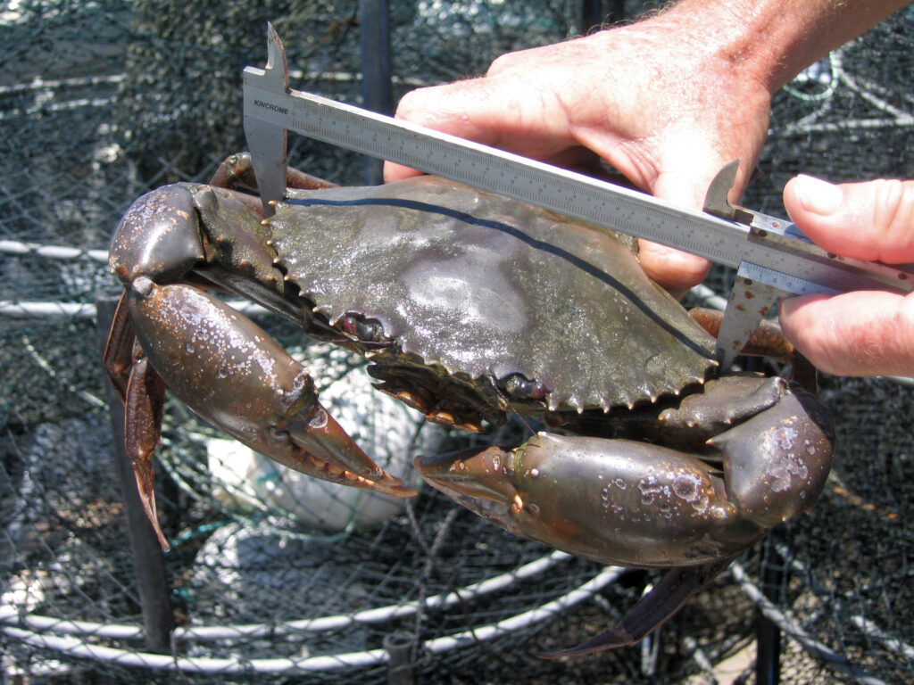
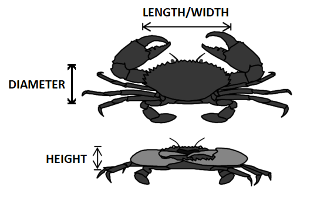

```{r setup, include=FALSE}
# clear-up the environment
rm(list = ls())

# chunk options
knitr::opts_chunk$set(
  message = FALSE,
  warning = FALSE,
  fig.align = "center",
  comment = "#>"
)

options(scipen = 999)
```

```{=html}
<style>
body { 
text-align: justify}
</style>
```

```{r, echo=FALSE}

```

# Introduction {.tabset}

## Latar Belakang

Industri perikanan kepiting memiliki tantangan dalam mengelola populasi dan memastikan produksi yang berkelanjutan. Salah satu aspek penting dalam manajemen populasi adalah pemahaman tentang pertumbuhan dan perkembangan kepiting, termasuk pemantauan usia kepiting yang dibiakkan.

Pemantauan usia kepiting merupakan langkah penting dalam pengelolaan populasi karena membantu dalam menentukan waktu panen yang optimal, memperkirakan ukuran kepiting yang layak untuk dijual, serta memahami pola pertumbuhan populasi. Namun, proses ini seringkali memerlukan biaya dan waktu yang signifikan, terutama jika dilakukan secara manual oleh tenaga kerja manusia.

Untuk meningkatkan efisiensi biaya dan waktu dalam pengembangbiakan kepiting, analisis regresi dapat menjadi alat yang efektif. Analisis regresi memungkinkan kita untuk memahami hubungan antara berbagai variabel  dimensi dan volume kepiting terhadap usia kepiting. Dengan memahami hubungan ini, kita dapat membangun model prediktif yang dapat digunakan untuk memperkirakan usia kepiting dan mengetahui variabel apa saja yang berpengaruh dalam menentukan usia kepiting.

Dengan menggunakan analisis regresi untuk memprediksi usia kepiting, pengembangbiakan kepiting dapat menghemat biaya dan waktu yang diperlukan untuk pemantauan manual usia. Selain itu, prediksi usia kepiting yang akurat juga dapat meningkatkan efisiensi operasional, memungkinkan petani untuk mengoptimalkan jadwal panen dan manajemen populasi secara keseluruhan.

Dengan menerapkan pendekatan ini, diharapkan bahwa industri pengembangbiakan kepiting dapat mencapai efisiensi yang lebih tinggi dalam manajemen populasi, serta mengurangi biaya dan waktu yang terlibat dalam pemantauan usia kepiting. Ini akan mendukung pertumbuhan yang berkelanjutan dalam industri perikanan kepiting sambil memastikan pengelolaan yang bertanggung jawab terhadap sumber daya laut.

***

## Tentang Data

Dataset ini diperoleh melalui kaggle *Crab Age Prediction* yang diposting oleh [GURSEWAK SINGH SIDHU](https://www.kaggle.com/datasets/sidhus/crab-age-prediction). Dataset ini berisi informasi pengukuran kepiting, dengan informasi kolom sebagai berikut:

```{r, echo=FALSE}

```


Deskripsi data `crab`:

- `Sex`              : Jenis kelamin kepiting
  + F (female)       : Betina
  + M (male)         : Jantan
  + I (Indeterminate): tak tentu
- `Length`           : Panjang cangkang kepiting (foot) 
- `Diameter`         : Lebar cangkang kepiting (foot)
- `Height`           : Tebal cangkang kepiting (foot)
- `Weight`           : Berat kepiting (ons)
- `Shucked.Weight`   : Berat kepiting tanpa cangkang (ons)
- `Viscera.Weight`   : Berat jeroan kepiting (ons)
- `Shell.Weight`     : Berat cangkang kepiting (ons)
- `Age`              : Usia kepiting (month)

**panduan ukuran**: 

- 1 foot = 30.48 cm 
- 1 ons  = 28,35 gram

***

# Analysis Preparation

## Load Packages
Pada artikel ini akan dilakukan pemodelan regresi menggunakan bahasa pemrograman R, berikut adalah beberapa packages yang akan digunakan dalam pemodelan kali ini.

```{r}
#Package untuk pemrosesan dataframe dan EDA
library(dplyr) 
library(tidyr)
library(corrplot)
library(class)

#Package untuk pengujian asumsi 
library(car)     
library(lmtest)

#Package untuk melakukan evaluasi model
library(caret)
library(MLmetrics)
library(performance)

#Package untuk melakukan visualisasi
library(ggplot2)
library(plotly)
library(glue)
library(GGally)
```

***

## Data Preparation
Sebelum dilakukan analisis data lebih lanjut, perlu dilakukan persiapan terlebih dahulu yakni:

1. *Read* data set
2. Pemeriksaan & penyesuaian tipe data

### Load Data Set

Untuk load data kedalam R kita gunakan fungsi read.csv untuk membaca data`CrabAgePrediction.csv`
```{r}
crab <- read.csv("data_input/CrabAgePrediction.csv") 
head(crab)
```

***

### Data Type Checking & Adjustment

Sebelum dilakukan analisis, perlu diperiksa terlebih dahulu apakah tipe data setiap kolom variabel sudah sesuai.

```{r}
# Pemeriksaan tipe data
glimpse(crab)
```
💡 Hasil pemeriksaan tipe data: 

- data terdiri dari 3.893 observasi
- terdapat 9 kolom variabel karakteristik kepiting
- untuk kolom Sex perlu dilakukan penyesuaian menjadi tipe `factor`

```{r}
# Penyesuaian Tipe data
crab <- crab %>% mutate(Sex = factor(Sex, levels = c("I","F","M")))
glimpse(crab)
```
***

# Data Analysis

## Exploratory Data Analysis

Setelah kita selesai dengan preparasi data, selanjutnya akan kita lakukan tahapan eksplorasi data dengan tujuan untuk mendapatkan gambaran dari data yang kita miliki. Tahapan yang akan kita lakukan dalam eksplorasi kali ini antara lain:

1. Pemeriksaan dan penanganan _missing value_
2. Ringkasan data
3. Sebaran data
4. Korelasi antar variabel

### Missing value Checking

Pemeriksaan _missing value_ dilakukan dengan tujuan untuk mengetahui apakah ada informasi kolom dari data yang tidak lengkap, sehinga apabila ditemukan kondisi data yang tidak lengkap dapat dilakukan penanganan sebelum dilkukan analisa lanjutan.
untuk melakukannya dapat kita gunakan gabungan fungsi `colSums()` dan `is.na()`.
```{r}
colSums(is.na(crab))
```
Berdasarkan pemeriksaan diatas diketahui bahwa tidak terdapat _missing value_ untuk setiap kolom pada data crab. Sehingga data dapt kita lakukan pengolahan tahap selanjutnya.

***

### Summary of Data

Untuk mengetahui kondisi dari data yang kita miliki, kita bisa melihat secara sekilas dari ringkasan data yang dapat diperoleh menggunakan fungsi `summary()`
```{r}
#persebaran data target
summary(crab)
```
💡 Insight: 

Berdasarkan summary diatas dapat kita ketahui bahwa:

- jumlah data kepiting berjenis kelamin jantan lebih banyak +- 200an data dibandingkan dengan jenis kelmin betina dan yang belum teridentifikasi jenis kelaminnya
- rata-rata panjang tubuh kepiting adalah 1.3113 kaki atau setara dengan 39,97 cm
- rata-rata diameter tubuh kepiting adalah 1.0209 kaki atau setara dengan 31.12 cm
- rata-rata tinggi tubuh kepiting adalah 0.3494 kaki atau setara dengan 10.65 cm
- rata-rata berat kepiting keseluruhan adalah 23.5673 ons atau setara dengan 668.12 gram
- rata-rata berat daging kepiting tanpa cangkang adalah 10.20734 ons atau setara dengan 289.37 gram
- rata-rata berat jeroan kepiting adalah 5.13655 ons atau setara dengan 145.62 gram
- rata-rata berat cangkang kepiting adalah 6.79584 ons atau setara dengan 192.66 gram

***

### Data Distribution

**1. Crab Age**
```{r,class.source = 'fold-hide'}
age<-ggplot(data = crab, mapping = aes(y = Age, x = Sex))+
  geom_boxplot(fill = "black", color = "red")+
  geom_hline(aes(yintercept = mean(Age)), lwd = 0.8, linetype="dotted")+
  labs(title = "Distribution Crab Age by Sex",
       x = "Sex",
       y = "Age") +
  theme_minimal() +
  theme(plot.title = element_text(hjust = 0.5))

ggplotly(age)
```

💡 Insight: 

Berdasarkan hasil visualisasi boxplot usia kepiting berdasarkan jenis kelamin kepiting diatas dapat kita ketahui bahwa kepiting yang belum teridentifikasi jenis kelaminnya adalah kepiting yang berada di rentang usia kurang dari 9 bulan.


**2. Crab Dimension**
```{r,class.source = 'fold-hide'}
# Crab length
p1 <-ggplot(data = crab, mapping = aes(y = Length, x = Sex))+
  geom_boxplot(fill = "black", color = "red")+
  geom_hline(aes(yintercept = mean(Length)), lwd = 0.8, linetype="dotted")+
  labs(title = "Distribution Crab Dimension by Sex",
       x = "Sex",
       y = "Length") +
  theme(plot.title = element_text(hjust = 0.5, vjust = 1.1))

# Crab Diameter
p2 <-ggplot(data = crab, mapping = aes(y = Diameter, x = Sex))+
  geom_boxplot(fill = "black", color = "red")+
  geom_hline(aes(yintercept = mean(Diameter)), lwd = 0.8, linetype="dotted")

#Crab Height
p3 <-ggplot(data = crab, mapping = aes(y = Height, x = Sex))+
  geom_boxplot(fill = "black", color = "red")+
  geom_hline(aes(yintercept = mean(Height)), lwd = 0.8, linetype="dotted")


fig1 <- subplot(
  ggplotly(p1), 
  ggplotly(p2),
  ggplotly(p3), 
  nrows = 1,
  heights = 0.8) 


annotations = list( 
  list( 
    x = 0.175,  
    y = 0.9,  
    text = "Crab Length",  
    xref = "paper",  
    yref = "paper",  
    xanchor = "center",  
    yanchor = "bottom",  
    showarrow = FALSE 
  ),  
  list( 
    x = 0.5,  
    y = 0.9,  
    text = "Crab Diameter",  
    xref = "paper",  
    yref = "paper",  
    xanchor = "center",  
    yanchor = "bottom",  
    showarrow = FALSE 
  ),  
  list( 
    x = 0.85,  
    y = 0.9,  
    text = "Crab Height",  
    xref = "paper",  
    yref = "paper",  
    xanchor = "center",  
    yanchor = "bottom",  
    showarrow = FALSE 
  ))

fig1 %>% layout(annotations = annotations)
```

💡 Insight:

Berdasarkan hasil visualisasi boxplot diatas dapat kita ketahui bahwa kepiting jantan cenderung memiliki ukuran yang lebih besar dibandingkan kepiting betina, dan terdapat kepiting dengan tinggi badan cukup ekstrim yaitu 2.83 kaki atau setara dengan 86.26 cm, hal tersebut mengindikasikan adanya kesalahan input data dikarenakan sangat kecil kemungkinan ditemukannya kepiting dengan tinggi badan yang hampir mendekati 1 meter.


**3. Crab Volume**


```{r,class.source = 'fold-hide'}
# Crab Weight
p4 <-ggplot(data = crab, mapping = aes(y = Weight, x = Sex))+
  geom_boxplot(fill = "black", color = "red")+
  geom_hline(aes(yintercept = mean(Weight)), lwd = 0.8, linetype="dotted")+
  labs(title = "Distribution Crab Volume by Sex",
       x = "Sex",
       y = "Length") +
  theme(plot.title = element_text(hjust = 0.5, vjust = 1.1))

# Crab Shucked.Weight
p5 <-ggplot(data = crab, mapping = aes(y = Shucked.Weight, x = Sex))+
  geom_boxplot(fill = "black", color = "red")+
  geom_hline(aes(yintercept = mean(Shucked.Weight)), lwd = 0.8, linetype="dotted")

# Crab Viscera.Weight
p6 <-ggplot(data = crab, mapping = aes(y = Viscera.Weight, x = Sex))+
  geom_boxplot(fill = "black", color = "red")+
  geom_hline(aes(yintercept = mean(Viscera.Weight)), lwd = 0.8, linetype="dotted")

# Crab Shell.Weight
p7 <-ggplot(data = crab, mapping = aes(y = Shell.Weight, x = Sex))+
  geom_boxplot(fill = "black", color = "red")+
  geom_hline(aes(yintercept = mean(Shell.Weight)), lwd = 0.8, linetype="dotted")

fig2 <- subplot(
          ggplotly(p4), 
          ggplotly(p5),
          ggplotly(p6),
          ggplotly(p7),
          nrows = 1,
          heights = 0.8 )

annotations = list( 
  list( 
    x = 0.120,  
    y = 0.9,  
    text = "Crab Weight",  
    xref = "paper",  
    yref = "paper",  
    xanchor = "center",  
    yanchor = "bottom",  
    showarrow = FALSE 
  ),  
  list( 
    x = 0.375,  
    y = 0.9,  
    text = "Crab Shucked.Weight",  
    xref = "paper",  
    yref = "paper",  
    xanchor = "center",  
    yanchor = "bottom",  
    showarrow = FALSE 
  ),  
  list( 
    x = 0.625,  
    y = 0.9,  
    text = "Crab Viscera.Weight",  
    xref = "paper",  
    yref = "paper",  
    xanchor = "center",  
    yanchor = "bottom",  
    showarrow = FALSE 
  ),
  list( 
    x = 0.885,  
    y = 0.9,  
    text = "Crab Shell.Weight",  
    xref = "paper",  
    yref = "paper",  
    xanchor = "center",  
    yanchor = "bottom",  
    showarrow = FALSE 
  ))

fig2 %>% layout(annotations = annotations)

```

💡 Insight:

Berdasarkan hasil visualisasi boxplot diatas terlihat bahwa dari semua informasi berat yang ada memiliki visual yang sama, hal ini terjadi karea tiga informasi berat daging kepiting tanpa cangkang, berat jeroan kepiting dan berat cangkang bisa terwakili oleh satu informasi utama yakni berat kepiting keseluruhan. Olehkarenanya dalam analisa selanjutnya bisa digunakan berat kepiting secara keseluruhan yang diperoleh dari hasil penimbangan singkat tanpa harus melakukan pembedahan dan pemisahan bagian kepiting. Dan dapat kita ketahui juga apabila kepiting jantan cenderung lebih berat dibandingkan dengan kepiting betina, hal ini bisa terjadi diindikasikan karena biasanya kepiting jantan memiliki ukuran capit yang dapat bertumbuh lebih besar dibandingkan kepiting betina.
 
***

### Correlation

Korelasi merupakan suatu nilai yang menggambarkan seberapa erat hubungan antara suatu variabel teerhadap variabel lainnya, nilai korelasi yang mendekati 1 menunjukkan korelasi positif kuat dan nilai korelasi yang mendekati -1 menunjukkan korelasi negatif kuat. 

Nilai korelasi juga dapat digunakan sebagai salah satu pemeriksaan adanya multikolinieritas antara variabel prediktor, yang dapat dilihat dari hubungan yang kuat antara variabel prediktor.

```{r fig.width=13}
ggcorr(crab,label = TRUE )
```

💡 Insight:

Berdasarkan hasil visualisasi corelation plot yang berwarna merah diatas dapat kita ketahui bahwa seluruh variabel dimensi dan volume memiliki korelasi positif terhadap usia. Dan terlihat bahwa terdapat nilai korelasi sempurna sebesar 1, yang ditunjukkan antara variabel volume (berat, berat cangkang, berat jeroan, dan berat kepiting tanpa cangkang). oleh karenanya pada tahapan selanjutnya cukup digunakan satu informasi berat kepiting saja.

***

## Model Building

### Cross-Validation

Tahapan awal yang perlu dilakukan sebelum pembuatan model adalah _cross validation_ dimana tahapan ini akan membagi data menjadi  dua bagian, yakni `_data train_` dan `_data test_`. Hal ini bertujuan **untuk mengetahui seberapa baik model untuk memprediksi _unseen data_** *[data baru yang belum pernah
dilihat oleh model]*, dimana:

- _data train_ akan digunakan untuk membuat model dengan jumlah proporsi data yang lebih besar dibandingkan dengan data test, sedangkan
- _data test_ akan digunakan untuk mengevaluasi model yang telah dibuat menggunakan _data train_

untuk melakukan cross validation, kita dapat menggunakan fungsi `sample()` yang akan mengambil `index` dari jumlah data. paramater :

-   **x** = berisi list / jumlah data populasi
-   **size** = besaran proporsi data yg akan diambil

index yang diperoleh pada **hasil sample** akan sangat **dimungkinkan berbeda** setiap kali *kode ini dijalankan* dan atau di setiap *device*. Untuk mengatur agar setiap hasil sample yang dijalankan akan sama maka fungsi **`sample()`** ini perlu dijalankan beriringan dengan fungsi **`set.seed()`**.

Pada analisis kali ini akan digunakan **75%** data sebagai _data train_, dan sisanya **25%** data akan digunakan sebagai _data test_.

```{r}
RNGkind(sample.kind = "Rounding")
set.seed(417)

# index sampling 
# ---- mengambil 25 persen index dari jumlah data -----
index <- sample(x = nrow(crab),size = round(0.25*nrow(crab))) 

# splitting data 
crab_test  <- crab[index,]  #ambil data 25%
crab_train <- crab[-index,] #ambil data 75%
```

Dan berikut ini adalah hasil pembagian dataset
```{r,class.source = 'fold-hide' }
# menampilkan jumlah data hasil pembagian
j.data <- data.frame(Data = c("Data Train (75%)","Data Test (25%)","Total Data (100%)"),
                     n = c(nrow(crab_train),nrow(crab_test),nrow(crab)))
j.data
```

***

### Multicolinierity Checking

Sebelum dilakukan pemodelan, terdapat satu asumsi Regresi yang perlu diuji terlebih dahulu. yakni asumsi multikolinieritas. Multikolinieritas adalah kondisi adanya **korelasi antar prediktor yang kuat**. Hal ini tidak diinginkan karena menandakan prediktor redundan pada model, yang seharusnya dapat dipilih salah satu saja dari variable yang hubungannya amat kuat tersebut. Harapannya **tidak terjadi multikolinieritas**

Untuk menguji VIF (Variance Inflation Factor) dapat dilakukan menggunakan fungsi `vif()` dari package `car`, dengan ketentuan:

- nilai `VIF > 10`: terjadi multikolinieritas pada model
- nilai `VIF < 10`: tidak terjadi multikolinieritas pada model
```{r}
lm(Age ~., crab_train) %>%  # membuat model regresi linier
  vif()                     # memeriksa nilai VIF
```
Berdasarkan hasil pemeriksaan nilai VIF diatas, dapat kita ketahui bahwa:

1. Tidak terjadi multikolinieritas untuk variabel `Sex` dan `Height`
2. Terjadi multikolinieritas antara variabel `Length` dengan `Diameter`, sehingga bisa dipilih salah satu saja untuk digunakan dalam pemodelan.
3. Terjadi multikolinieritas antara variabel `Weight`, `Shucked.Weight`, `Viscera.Weight`, dan `Shell.Weight`, sehingga bisa dipilih salah satu saja untuk digunakan dalam pemodelan

Selanjutnya akan dicoba diperiksa nilai VIF untuk model regresi dengan variabel `Sex`, `Height`, `Length`, dan `Weight`.

```{r}
lm(Age ~ Sex + Height + Length + Weight , crab_train) %>%  # membuat model regresi linier
  vif()  # memeriksa nilai VIF
```
Setelah dikeluarkan beberapa variabel prediktor, kini sudah tidak lagi ditemukan multikolinieritas. Sehingga pada tahapan selanjutnya hanya akan digunakan variable berikut :

1. Sex
2. Height
3. Length
4. Weight

***

### Model Fitting {.tabset}

Selanjutnya adalah membuat model regresi linier, yang dapat dilakukan menggunakan fungsi `lm`() dengan parameter:

- `formula` : target ~ prediktor
- `data` : data yang digunakan

#### Simple Linear Regression

Akan dibuat model regresi linear sederhana (1 variabel prediktor) dengan variabel prediktor `Length` karena variabel tersebut memiliki korelasi positif tertinggi di antara variabel lainnya terhadap variabel target `Age`.
```{r}
model1 <- lm(formula = Age ~ Length, 
                 data = crab_train) 
summary(model1)
```
💡 Insight: 

Berdasarkan hasil summary model diatas dapat kita ketahui bahwa :

- Hasil pengujian signifikansi prediktor diperoleh nilai p-value untuk variabel `Length` sebesar 0.0000000000000002 < 0.05, maka dapat dinyatakan bahwa variabel `length` signifikan berpengaruh terhadap Usia kepiting.

- diperoleh nilai _adj.R-squared_ sebesar 0.3031 dengan kata lain hanya sebesar 30.31% dari variabel `Length` dapat menjelaskan model (pengaruh terhadap Usia Kepiting).

- walaupun variabel `Length` signifikan berpengaruh terhadap Usia kepiting, namun nilai _adj.R-squared_ yang diperoleh masih terlalu kecil, sehingga untuk meningkatkan nilai _adj.R-squared_ perlu dilakukan penambahan variabel lainnya.

dan dibawah ini adalah bentuk visualisasi garis regresi yang terbentuk antara variabel `Length` dan `Age`
```{r}
ggplot(data = crab_train, mapping=aes(x = Length, y = Age))+
  geom_point()+
  scale_color_brewer(palette="Accent")+
  geom_smooth(method="lm", se=FALSE)+
  labs(title="Plot Regresi Crab Length vs Crab Age")+
  theme_minimal()
```

***

#### Multiple Linear Regression

Untuk meningkatkan performa model akan dibuat model regresi linear berganda (lebih dari 1 variabel prediktor).

- Variabel target: Age
- Variabel PRediktor:
  + Sex
  + Height
  + Length
  + Weight
  
```{r}
model2 <- lm(formula = Age ~ Sex + Height + Length + Weight, 
                 data = crab_train) 
summary(model2)
```
💡 Insight: 

Berdasarkan hasil summary model diatas dapat kita ketahui bahwa :

- Dari keseluruhan variabel yang disertakan, kini hanya variabel `Length` yang tidak signifikan berpengaruh terhadap Usia kepiting.

- diperoleh nilai _adj.R-squared_ sebesar 0.3792 dengan kata lain hanya sebesar 37.92% dari variabel - variabel dapat menjelaskan model (pengaruh terhadap Usia Kepiting).

- hasil penambahan variabel prediktor hanya meningkatkan performa model sebesar 0.0761 atau sebesar 7,61%.

***

### Model evaluation {.tabset}

#### Model Performance

Untuk mengetahui apakah model yang sudah dibuat cukup baik dalam memprediksi data baru, dapat dilihat dengan melihat apakah hasil prediksi tersebut sudah menghasilkan _error_ yang paling kecil. _Error_/residual adalah selisih antara hasil prediksi dengan nilai aktual. Untuk melihat seberapa besar tingkat error dapat dilakukan dengan menggunakan nilai MAPE ( _Mean Absolute Percentage Error_ ) yang didapat dilakukan dengan fungsi `MAPE()`.

```{r}
pred_train <- model2$fitted.values
pred_test <- predict(model2,crab_test)

Eval <- data.frame(Data = c("Data Train", "Data Test"),
                   MAPE = c(MAPE(pred_train,crab_train$Age)*100, MAPE(pred_test, crab_test$Age)*100))
Eval
```

💡 Insight: 

Berdasarkan hasil evaluasi `model2` diatas, diperoleh nilai MAPE untuk data train dan data test kurang dari 20%. Artinya model sudah cukup baik untuk digunakan memprediksi data baru.

***

#### Regression Assumption Check

Terdapat 4 pengujian asumsi regresi yang harus dilakukan antara lain:

1. Multikolinearitas
2. Linearitas
3. Normalitas
4. Heteroskedastisitas


**1. Linieritas**

Linearitas artinya target variabel dengan prediktornya memiliki hubungan yang linear atau hubungannya bersifat garis lurus.

Untuk menentukan asumsi linearity dari sebuah model regresi (multiple linier regreesion) dapat dilakukan dengan membuat **plot residual vs fitted values**. Plot ini merupakan scatter plot dengan sumbu x adalah fitted values (hasil prediksi variabel target) dan sumbu y adalah nilai residual/error yang dihasilkan oleh model.

Untuk melakukannya dapat kita gunakan dengan bantuan visual dari fungsi `plot(nama_model, which = 1)`. 

> kondisi yang diharapkan dari hasi visual adalah nilai residual "bounce randomly" di sekitar nilai 0.

```{r}
plot(model2, # model yg akan diujikan
     which = 1) # residual vs fitted
```
💡 Insight:

Berdasarkan hasil visualisasi scatter plot residual vs fitted values diatas dapat kita ketahui bahwa residual menyebar cukup acak di sekitar garis nol.

**2. Normalitas**

Untuk melakukan pengujian normalitas sisaan dapat kita lakukan menggunakan fungsi `shapiro.test()` dari package `stats` dengan hipotesis yang diuji adalah sebagai berikut:

| H0 : Sisaan menyebar normal
| H1 : Sisaan tidak menyebar normal

dengan kriteria pengujian H0 ditolak jika P-value < α. Nilai α yang digunakan sebesar 5%.

> hasil yang diharapkan adalah menerima H0 (p-value > 0)

```{r}
shapiro.test(model2$residuals)
```
💡 Insight:

Berdasarkan hasil pengujian shapiro test diatas dapat kita ketahui bahwa sisaan tidak menyebar secara normal. Artinya **asumsi normalitas tidak terpenuhi**.


**3. Heteroskedastisitas**

Untuk melakukan pengujian heteroskedastisitas varians dapat kita lakukan menggunakan fungsi `bptest()` dari package `lmtest` dengan hipotesis yang diuji adalah sebagai berikut.

| H0 : Sisaan memiliki ragam homogen
| H1 : Sisaan tidak memiliki ragam homogen


dengan kriteria pengujian H0 ditolak jika P-value < α. Nilai α yang digunakan sebesar 5%.

> hasil yang diharapkan adalah menerima H0 (p-value > 0)

```{r}
bptest(model2)
```
💡 Insight:

Berdasarkan hasil pengujian breusch-pagan test diatas dapat kita ketahui bahwa sisaan tidak memiliki ragam yang homogen. Artinya **asumsi heteroskedastisitas tidak terpenuhi**.

***

## Model Improvement {.tabset}

Dari hasil pengujian asumsi yang telah dilakukan 2 dari 4 asumsi yang terpenuhi, yakni tidak terjadi multikolinieritas dan linieritas. Sedangkan untuk asumsi normalitas dan heteroskedastisitas. 

Salah satu metode yang dapat dilakukan agar dapat memenuhi asumsi normalitas dan heteroskedastisitas adalah dengan melakukan transformasi data untuk variabel prediktor dan respon, dan salah satu transformasi yang dapat dilakukan adalah transformasi logaritmik. 

Dengan mempertimbangkan hasil uji signifikansi yang diperoleh dari summary `model2` yang telah dibuat, variabel prediktor `Length` memiliki nilai p-value yang lebih besar diantara variabel prediktor lainnya. Maka untuk variabel prediktor `Length` dan variabel target `Age`.

### Model Tuning

```{r}
model_tuning <- lm(formula = log(Age) ~ Sex + Height + log(Length) + Weight, 
                 data = crab_train) 
summary(model_tuning)

```
💡 Insight:

Berdasarkan hasil summary `model_tuning` diatas terlihat kini seluruh prediktor sudah signifikan yang ditandai dengan adanya tanda *** dan nilai p-value < 0,05. dan terjadi peningkatan pada nilai Adjusted R-squared menjad 0.505.

### Model Performance

Dikarenakan model_tuning yang dibuat dengan target dan prediktor yang sudah ditransformasi menajdi logaritmik, maka untuk hasil prediksi perlu dikembalikan kedalam nilai asli terlebih dahulu dengan menggunakan fungsi `exp()`.
```{r}
pred_train2 <- exp(model_tuning$fitted.values)
pred_test2 <- exp(predict(model_tuning,crab_test))

Eval_tuning <- data.frame(Data = c("Data Train", "Data Test"),
                   MAPE_model2 = c(MAPE(pred_train,crab_train$Age)*100, 
                                   MAPE(pred_test, crab_test$Age)*100),
                   MAPE_Tuning = c(MAPE(pred_train2,crab_train$Age)*100, 
                                   MAPE(pred_test2, crab_test$Age)*100))
Eval_tuning
```

💡 Insight: 

Berdasarkan hasil evaluasi `model_tuning` diatas terlihat adanya perubahan performa baik pada data train maupun data test setelah dilakukan tuning model. Namun melihat dari nilai MAPE yang tidak lebih dari 25%, maka model dirasa masih cukup baik dalam memprediksi data baru.

***

### Assumption Checking

**1. Linearitas**

```{r}
plot(model_tuning, which = 1)
```
💡 Insight:

Berdasarkan hasil visualisasi scatter plot residual vs fitted values diatas dapat kita ketahui bahwa residual menyebar cukup acak di sekitar garis nol.


**2. Normalitas**

Hipotesis yang diujikan:

| H0 : Sisaan menyebar normal
| H1 : Sisaan tidak menyebar normal

dengan kriteria pengujian H0 ditolak jika P-value < α. Nilai α yang digunakan sebesar 5%.

> hasil yang diharapkan adalah menerima H0 (p-value > 0)

```{r}
shapiro.test(model_tuning$residuals)
```

💡 Insight:

Berdasarkan hasil pengujian shapiro test diatas dapat kita ketahui bahwa sisaan tidak menyebar secara normal. Artinya **asumsi normalitas masih tidak terpenuhi**.


**3. Heteroskedastisitas**

Hipotesis yang diujikan:

| H0 : Sisaan memiliki ragam homogen
| H1 : Sisaan tidak memiliki ragam homogen

dengan kriteria pengujian H0 ditolak jika P-value < α. Nilai α yang digunakan sebesar 5%.

> hasil yang diharapkan adalah menerima H0 (p-value > 0)

```{r}
bptest(model_tuning)
```

💡 Insight:

Berdasarkan hasil pengujian breusch-pagan test diatas dapat kita ketahui bahwa sisaan tidak memiliki ragam yang homogen. Artinya **asumsi heteroskedastisitas masih tidak terpenuhi**.

> Model regresi ketat akan asumsi,namun pada kondisi di lapangan untuk memenuhi keempat asumsi ini sangat sulit terpenuhi. oleh karenanya, sebagai syarat utama menggunakan model regresi minimal asumsi yang harus terpenuhinya adalah **asumsi linieritas** dan **no multikolinieritas**. Namun apabila ingin dioptimalkan agar model memenuhi asumsi normalitas dan heteroskedastisitasnya maka metode lain yang dapat dilakukan adalah dengan memberikan penanganan data outlier dan atau penambahan data. 

***

## Model Interpretation

Salah satu keunggulan model regresi adalah mudah untuk diinterpretasikan. Dikarenakan hasil transformasi tidak menjadikan model menjadi lebih baik, maka model final yang akan digunakan adalah `model2` yang dibuat menggunakan data asli.

```{r}
summary(model2)
```

💡 Insight: 

Berdasarkan pembuatan model regresi berganda sebelumnya diperoleh persamaan regresi sebagai berikut:

$$\hat{Age} = 2.573929 + 1.109700*SexF + 0.960195*SexM + 18.181021*Height + 0.591763*Length - 0.019679*Weight$$

1. Interpretasi coefficient untuk prediktor kategorik: `Sex`
    - Sex = I : menjadi basis
    - Sex = F : 1.109700, Usia kepiting lebih besar 1.109700 bulan apabila berjeniskelamin betina [SexF = 1 & Sex M = 0] dibandingkan dengan kepiting yang belum diketahui jenis kelaminnya [SexF = 0 & SexM = 0] dengan catatan variabel prediktor lainnya bernilai tetap
    - Sex = M : 0.960195, Usia kepiting lebih besar 0.960195 bulan apabila berjeniskelamin jantan [SexF = 0 & Sex M = 1] dibandingkan dengan kepiting yang belum diketahui jenis kelaminnya [SexF = 0 & SexM = 0] dengan catatan variabel prediktor lainnya bernilai tetap
    
2. Interpretasi coefficient untuk prediktor numerik:
    - `Height` : 18.181021, Usia kepiting akan bertambah sebesar 18.181021 bulan untuk setiap pertambahan tinggi sebesar 1 kaki, dengan catatan variabel prediktor lainnya bernilai tetap
    - `Length` : 0.591763, Usia kepiting akan bertambah sebesar 0.591763 bulan untuk setiap pertambahan panjang sebesar 1 kaki, dengan catatan variabel prediktor lainnya bernilai tetap
    - `Weight` : -0.019679, Usia kepiting akan berkurang sebesar 0.019679 bulan untuk setiap pertambahan berat sebesar 1 ons, dengan catatan variabel prediktor lainnya bernilai tetap

***

# Conclusion

Dari serangkaian proses analisis yang telah dilakukan dapat diperoleh kesimpulan bahwa kepiting yang belum teridentifikasi jenis kelaminnya cenderung berusia kurang dari 9 bulan, kepiting jantan cenderung memiliki dimensi dan volume yang lebih besar dibandingkan kepiting betina dan faktor-faktor yang signifikan dapat digunakan sebagai acuan prediksi usia kepiting oleh peternak kepiting adalah jenis kelamin kepiting, tinggi/ketebalan kepiting, dan berat kepiting.


